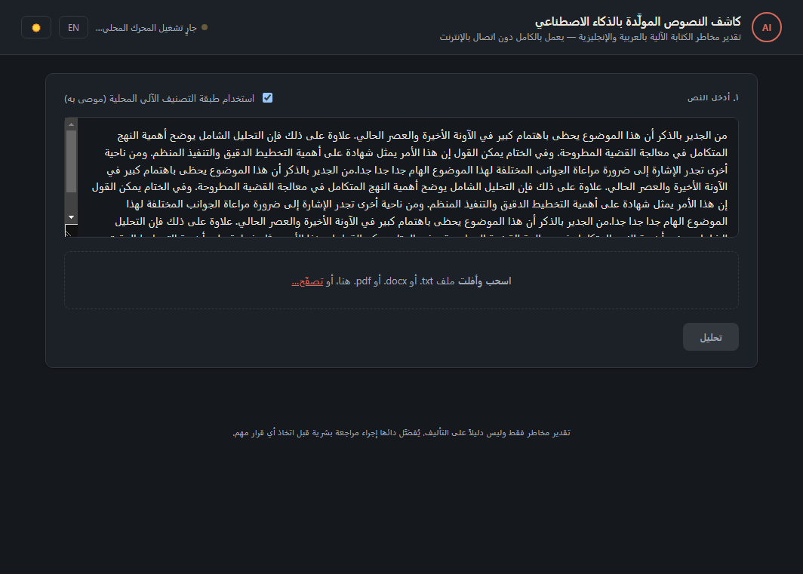
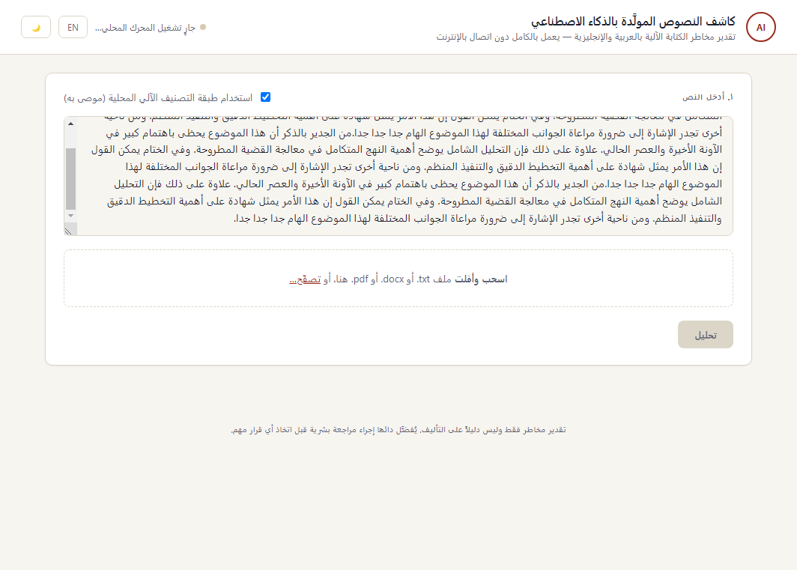

# Best AI Text Detector

<p align="center">
  
</p>

<p align="center">
  <a href="https://github.com/Astrobubu/arabic-ai-text-detector/actions/workflows/ci.yml"></a>
  
  
  
</p>

<p align="center">
  An explainable, cautious AI-generated text risk analyzer for coding agents and local workflows.
</p>

<p align="center">
  <a href="./README.zh-CN.md">简体中文</a>
  ·
  <a href="#install">Install</a>
  ·
  <a href="#evaluation">Evaluation</a>
  ·
  <a href="#use-cases">Use Cases</a>
</p>

This project is intentionally modest. It estimates **AI-like signals**, not proof of authorship.

<p align="center">
  
  
</p>

<p align="center">
  Same engine, same report - the desktop app's UI is fully bilingual (not just the input box),
  with real RTL layout for Arabic and a light/dark theme toggle.
  <br />
  <b><a href="https://github.com/Astrobubu/arabic-ai-text-detector/releases/latest">⬇ Download the Windows desktop app</a></b>
  (single installer, no Python/Node required, runs fully offline after install)
</p>

## Why This Exists

Most AI text detectors are either overconfident, opaque, or awkward to embed inside agent workflows.

`ai-detector-skill` takes the opposite approach:

- explainable weighted signals instead of hidden model claims
- **bilingual**: Arabic and English are both first-class, including a local ML classifier per language
- **two independent layers** (rule-based heuristics + a local ML model) shown separately, not blended into one opaque number
- runs **fully offline** - no document text ever leaves the machine
- a local CLI, Python API, HTTP server, and desktop app, so it fits agent workflows or a non-technical user's double-click app
- a short-text guardrail that refuses to overstate weak evidence
- skill-ready packaging for Codex, Claude Code, and other repo-aware agents
- reproducible benchmark and dataset evaluation scripts

If you want a **triage tool** that stays cautious and leaves room for human review, this repo is built for that.

## Models Used

Layer 2 (the local ML classifier) uses two small, pretrained, permissively-licensed models,
loaded fully offline after a one-time download:

| Language | Model | Base architecture | License |
| --- | --- | --- | --- |
| Arabic | [`sabaridsnfuji/arabic-ai-text-detector`](https://huggingface.co/sabaridsnfuji/arabic-ai-text-detector) | Fine-tuned [AraBERT-v2](https://huggingface.co/aubmindlab/bert-base-arabertv2) (~110M params) | Apache 2.0 |
| English | [`Hello-SimpleAI/chatgpt-detector-roberta`](https://huggingface.co/Hello-SimpleAI/chatgpt-detector-roberta) | Fine-tuned RoBERTa-base, trained on the [HC3 dataset](https://huggingface.co/datasets/Hello-SimpleAI/HC3) | MIT |

Both label mappings were verified against real inference output before being wired in, not
assumed from the model cards (the Arabic model's card documentation claimed literal `"HUMAN"`/`"AI"`
labels, but the model actually returns generic `LABEL_0`/`LABEL_1` - see `src/aidetect/ml_layer.py`
for the corrected, tested mapping). Layer 1 (rule-based heuristics: burstiness, formulaic phrase
matching, lexical diversity, compressibility, structural shape) has no model dependency at all -
see [core.py](./src/aidetect/core.py).

## Install

```bash
pip install -e .                    # Layer 1 only: rule-based heuristics, stdlib-only
pip install -e ".[all]"             # + local ML classifiers, .docx/.pdf upload, backend server
ai-detect examples/sample_ai_like.txt --json
```

Or bootstrap a local environment:

```bash
bash scripts/setup.sh
```

Example output:

```text
Language detected: en
Conclusion: AI-like signals are present, but this medium-confidence score is a risk estimate rather than proof.
Score: 84/100
Confidence: medium
Verdict: high_ai_likelihood
Words analyzed: 256

Layer 2 (local ML classifier):
- Model: Hello-SimpleAI/chatgpt-detector-roberta
- Label: ChatGPT (AI probability 91%)
- Verdict: high_ai_likelihood

Combined read (both_layers_flag_ai_like):
Both layers flag AI-like writing: heuristics 84/100, ML classifier 91% AI probability.
```

## What You Get

Each report has two independent layers plus a combined read - see [docs/LEGAL_USE.md](./docs/LEGAL_USE.md) for the full report contract used by the desktop app:

- **Layer 1 (heuristics, always on)**: `score`, `verdict`, `confidence`, `language`, `signals`, `caveats`, `next_steps`
- **Layer 2 (local ML classifier, optional extra)**: `model_id`, `label`, `ai_probability`, `verdict`, or a clear `available: false` + reason when the extra isn't installed
- **Combined**: `agreement` (e.g. `both_layers_flag_ai_like`, `layers_disagree`), a plain-English `summary`, and legal metadata (`generated_at`, `input_sha256`, `tool_version`)

This is designed to help an agent say:

- "AI-like signals are present."
- "The sample is too short for a meaningful estimate."
- "This should be reviewed against known writing samples."

Not:

- "This was definitely written by AI."
- "The detector proves misconduct."

## Usage

### CLI

```bash
ai-detect examples/sample_ai_like.txt          # .txt, .docx, or .pdf
ai-detect nadaa.docx --json                     # Arabic document, JSON report
cat essay.txt | ai-detect --json
ai-detect essay.txt --no-ml                     # heuristics only, skip the ML layer
python scripts/detect.py examples/sample_human_like.txt --json
```

### Python API

```python
from aidetect import generate_report

text = open("essay.txt", encoding="utf-8").read()
report = generate_report(text)

print(report.language, report.heuristic.score, report.ml.ai_probability, report.agreement)
print(report.summary)
```

`analyze_text(text)` (Layer 1 only, stdlib-only, no optional deps) is still available for lightweight/agent use.

### Desktop app (double-click, for non-technical users)

A local Electron app wraps the same engine with a paste-or-drop-a-file UI and PDF export - see [desktop/README.md](./desktop/README.md) to run it from source or build a Windows installer.

### Local HTTP server

```bash
pip install -e ".[server]"
ai-detect-server --port 8756
# POST /api/analyze/text {"text": "...", "use_ml": true}
# POST /api/analyze/file  (multipart file upload)
```

### Local Skill Install

```bash
cp -R ai-detector-skill "$CODEX_HOME/skills/"
```

Use the root [SKILL.md](./SKILL.md) as the portable skill definition, and keep [AGENTS.md](./AGENTS.md) at the repo root for repo-aware agents.

## Evaluation

We ran a reproducible evaluation on the public [HC3 dataset](https://huggingface.co/datasets/Hello-SimpleAI/HC3), using the English `finance`, `medicine`, and `open_qa` subsets with the first 100 rows from each subset.

Snapshot of the current detector on that slice:

- Human mean score: `5.4`
- AI mean score: `18.4`
- Mean separation: `13.0` points
- Human coverage: `0.427`
- AI coverage: `0.920`
- Covered accuracy at `score >= 45`: `0.317`

What that means in practice:

- the detector separates human and AI answers on average, but only weakly on HC3
- the short-text guardrail is doing useful work, especially on shorter human answers
- the current thresholds are conservative, which keeps false confidence down but also lowers recall
- this tool works better as **triage + explanation** than as a stand-alone classifier

See the full report in [docs/HC3_EVALUATION.md](./docs/HC3_EVALUATION.md).

Reproduce it with:

```bash
make eval-hc3
```

## Use Cases

### Teacher Triage

A teacher receives a polished 400-word reflection and wants a cautious signal before doing manual review.

Suggested workflow:

1. Run `ai-detect submission.txt --json`.
2. Read the strongest signals and caveats.
3. Compare the passage with known writing samples before making any judgment.

### Editorial Review

An editor wants to spot formulaic product reviews or guest posts before spending time on manual edits.

Why it fits:

- medium-length prose works better than short snippets
- explainable signals help justify why a draft feels templated

### Trust And Safety Queueing

A moderation team wants to sort suspicious long-form posts into a manual review queue, not auto-remove them.

Why it fits:

- the tool is conservative by design
- it helps with prioritization more than enforcement

### Internal Content QA

A team compares human drafts and AI-assisted drafts to see where language starts sounding too generic.

Why it fits:

- the score is useful as a relative signal across versions
- strongest signals can guide rewriting

## Not For

- disciplinary decisions about a named student or employee
- treating a single score as proof of cheating or fraud
- very short samples under about 80 words
- high-stakes authorship disputes without known-sample comparison
- **submitting this report as forensic proof in a legal proceeding on its own.** It is built to support a lawyer's
  own review (see [docs/LEGAL_USE.md](./docs/LEGAL_USE.md)), not to replace expert testimony or a certified forensic
  linguist when a case genuinely turns on authorship.

## Project Structure

```text
ai-detector-skill/
├── SKILL.md
├── scripts/
│   ├── detect.py
│   ├── setup.sh
│   ├── benchmark.py
│   ├── evaluate_hc3.py
│   ├── prefetch_models.py     # cache ML models locally for offline packaging
│   ├── run_backend.py         # PyInstaller entry point
│   └── build_backend.py       # freezes the backend for the desktop installer
├── references/
│   └── api-reference.md
├── docs/
│   └── LEGAL_USE.md           # report contract + guidance for legal-context use
├── assets/
│   ├── hero.svg
│   ├── score-bands.svg
│   ├── workflow.svg
│   ├── screenshots/
│   └── templates/
│       └── report.md
├── src/aidetect/
│   ├── core.py       # Layer 1: bilingual rule-based heuristics
│   ├── ml_layer.py   # Layer 2: local ML classifiers (Arabic + English)
│   ├── report.py     # combines both layers into one report
│   ├── extract.py    # .docx / .pdf / .txt text extraction
│   ├── server.py     # local HTTP backend for the desktop app
│   └── cli.py
├── desktop/           # Electron desktop app (see desktop/README.md)
├── tests/
├── AGENTS.md
└── README.md
```

## Dev Commands

```bash
make test
make demo
make benchmark
make eval-hc3
```

## CI

GitHub Actions automatically runs:

- `make test` on Python `3.9`, `3.11`, and `3.13`
- `make benchmark` to regenerate the synthetic benchmark report
- `make eval-hc3` to regenerate the HC3 evaluation report
- upload of `docs/BENCHMARK.md` and `docs/HC3_EVALUATION.md` as workflow artifacts

## Contributing

See [CONTRIBUTING.md](./CONTRIBUTING.md).

Good contributions usually improve one of these:

- clearer evidence signals
- safer wording and UX
- multilingual handling that stays explainable
- reproducible evaluation coverage
- agent integration ergonomics

## Collaborate

Building on this, using it commercially, or want to talk through where it could go next (more
languages, a hosted version, integrations)? Message me directly on WhatsApp:
**[+971 56 149 5656](https://wa.me/971561495656)**.

## License

MIT
